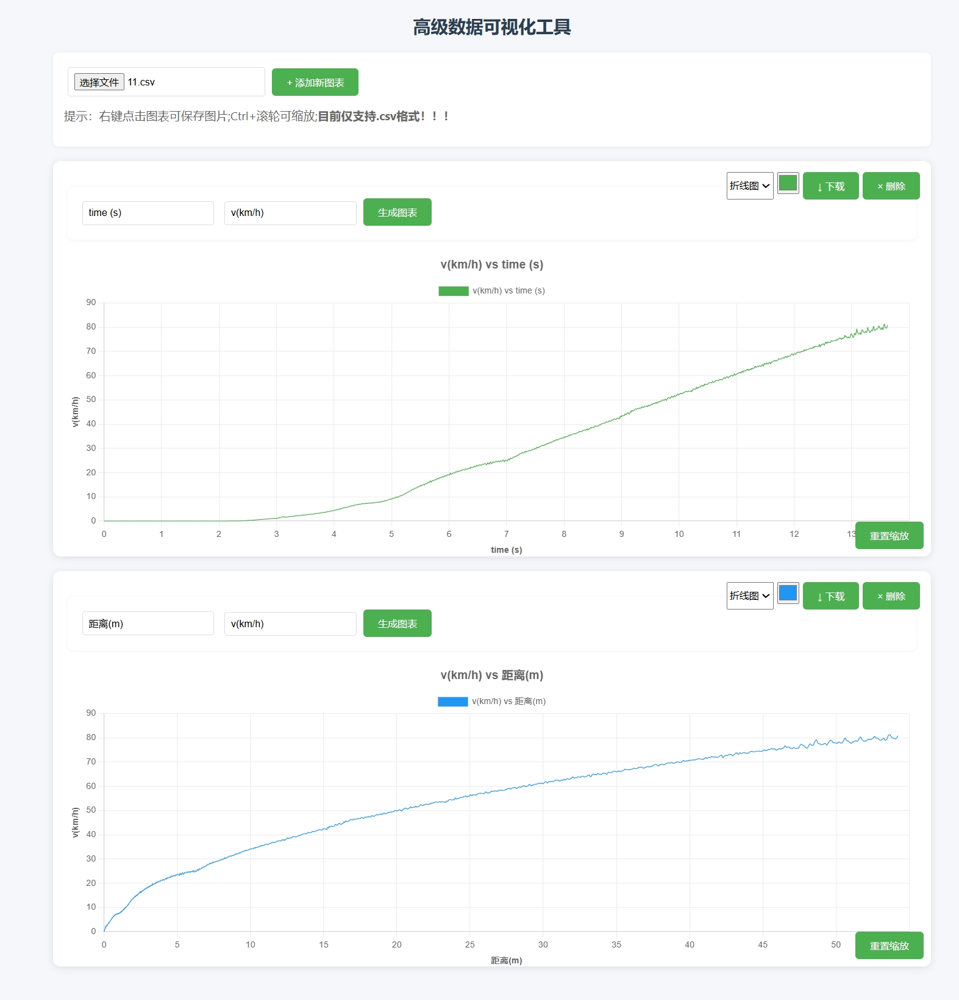

# CSV 数据可视化工具

A Web-based CSV data visualization tool.



一个基于 Web 的交互式数据可视化工具，支持 CSV 文件解析、多图表展示和高级数据分析功能。

## 主要功能

- 📁 CSV 文件上传与智能解析
- 📈 多图表支持（折线图、柱状图、散点图）
- 🎨 动态样式配置
  - 自定义颜色选择
  - 图表类型切换
  - 智能点大小调整（自动优化散点图显示）
- 🔍 交互功能
  - 滚轮缩放
  - 拖拽平移
  - 双击重置视图
- ⬇️ 图表下载功能（PNG 格式）
- 📊 数据验证
  - 自动检测数值有效性
  - 表头严格匹配
- 📱 响应式设计

## 使用指南

1. **上传 CSV 文件**

   - 点击"选择文件"按钮上传标准 CSV 文件
   - 支持包含标题行和数值数据

2. **添加图表**

   - 点击"+ 添加新图表"创建新图表面板
   - 每个图表独立配置：
     - X/Y 轴字段输入
     - 图表类型选择（下拉菜单）
     - 颜色选择器

3. **图表交互**

   - **缩放**：使用 Ctrl+鼠标滚轮
   - **重置**：点击"重置缩放"按钮
   - **下载**：点击"下载"按钮保存 PNG

4. **数据格式要求**
   - 第一行为表头
   - 数值列应为有效数字
   - 示例格式：
     ```csv
     Time,Temperature,Pressure
     0,25.3,101.2
     1,26.1,101.1
     2,26.8,100.9
     ```

## 安装与运行

```bash
# 克隆仓库
git clone https://github.com/yourusername/csv-visualizer.git

# 进入项目目录
cd csv-visualizer

# 直接使用浏览器打开
open index.html  # 或双击文件
```
